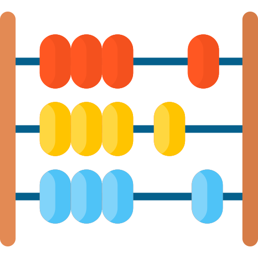

<p align="center" style="text-align:center">
    
</p>

# count-value-in-array

> count value in array

[](https://www.npmjs.com/package/count-value-in-array)
[](https://www.jsdelivr.com/package/npm/count-value-in-array)


## Table of Contents

- [Quick start](#quick-start)
  - [Install](#install)
  - [Initialization](#initialization)
- [Methods](#methods)
  - [countValueInArray](#countValueInArray)

## Quick start

### Install

We support all platforms.

#### npm

For module bundlers such as Webpack or Browserify.

```shell
npm i count-value-in-array
```

#### Include with &lt;script&gt;

1. <a href="https://cdn.jsdelivr.net/npm/count-value-in-array/dist/lib/count-value-in-array.js" target="_blank">Download lib</a>
2. Add script to html

```html
<script src="count-value-in-array.js"></script>
```

##### CDN

Recommended for learning purposes, you can use the latest version:

```html
<script src="https://cdn.jsdelivr.net/npm/count-value-in-array/dist/lib/count-value-in-array.js"></script>
```

Recommended for production for avoiding unexpected breakage from newer versions:

```html
<script src="https://cdn.jsdelivr.net/npm/count-value-in-array@0.0.0/dist/lib/count-value-in-array.js"></script>
```

### Initialization

#### ES6

count-value-in-array as an ES6 module.

```js
import countValueInArray from 'count-value-in-array';

const valueQuantity = countValueInArray([1, 2, 3, 1, 1, 1], 1)
```

#### Node

count-value-in-array as a Node.js module

```js
const countValueInArray = require('count-value-in-array');

const valueQuantity = countValueInArray([1, 2, 3, 1, 1, 1], 1)
```

#### Browser

Exports a global variable called `countValueInArray`. Use it like this

Connect to html file ```<script src="https://cdn.jsdelivr.net/npm/count-value-in-array/dist/lib/count-value-in-array.js" ></script>```

```html
<script>
    const valueQuantity = countValueInArray([1, 2, 3, 1, 1, 1], 1)
</script>
```

#### AMD

count-value-in-array as an AMD module. Use with Require.js, System.js, and so on.

1. <a href="https://cdn.jsdelivr.net/npm/count-value-in-array/dist/lib/count-value-in-array.js" target="_blank">Download lib</a>
2. Connect to your module loader

```js
requirejs(['count-value-in-array'], function(countValueInArray) {
    const valueQuantity = countValueInArray([1, 2, 3, 1, 1, 1], 1)
});
```

## Methods

### countValueInArray

Count values in array


#### Params
- `arrayForCount`
  - Type: `Array`
  - Description: array where count value
- `countValue`
  - Type: `any`
  - Description: value which count

#### Returns
- `boolean`

#### Example
```JS
const arrayForCount = [1, 2, 3, 1, 1, 1]
countValueInArray(arrayForCount, 1)
// => 4

const arrayForCount = [
 {name: 'BMW', age: 2},
 {name: 'Audi', age: 3},
 {name: 'Porsche', age: 4},
 {name: 'BMW', age: 2},
]
countValueInArray(arrayForCount, {name: 'BMW', age: 2})
// => 2
```


## Author

webster6667
